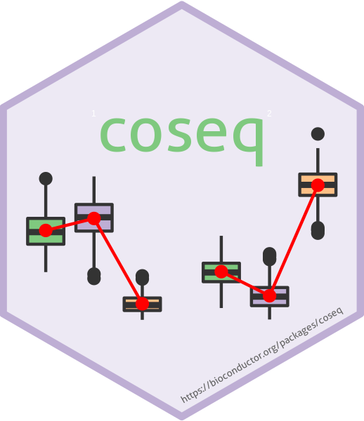

```{r, fig.align = "center", out.width = "50%", echo=FALSE}

options(rmarkdown.html_vignette.check_title = FALSE)
```

*coseq* is a package to perform clustering analysis of sequencing data 
(e.g., co-expression analysis of RNA-seq data), using transformed profiles rather than the raw counts directly. The package implements two distinct strategies in conjunction with transformations: 1) MacQueen's *K*-means algorithm and 2) Gaussian mixture models. For both strategies model selection is provided using the slope heuristics approach and integrated completed likelihood (ICL) criterion, respectively. Note that for backwards compatibility, *coseq* also provides a wrapper for the Poisson mixture model originally proposed in Rau et al. (2015) and implemented in the *HTSCluster* package.

The methods implemented in this package are described in detail in the following three publications.

* Godichon-Baggioni, A., Maugis-Rabusseau, C. and Rau, A. (2018) Clustering transformed compositional data using K-means, 
with applications in gene expression and bicycle sharing system data. *Journal of Applied Statistics*, doi:10.1080/02664763.2018.1454894.
[Paper that introduced the use of the K-means algorithm for RNA-seq profiles after transformation
via the centered log ratio (CLR) or log centered log ratio (logCLR) transformation.]

* Rau, A. and Maugis-Rabusseau, C. (2018) Transformation and model choice for co-expression analayis of RNA-seq data. *Briefings in Bioinformatics*, 19(3)-425-436.
[Paper that introduced the idea of clustering profiles for RNA-seq co-expression, and suggested
using Gaussian mixture models in conjunction with either the arcsine or logit transformation.]

* Rau, A., Maugis-Rabusseau, C., Martin-Magniette, M.-L., Celeux, G. (2015) Co-expression analysis of high-throughput transcriptome sequencing data with Poisson mixture models. *Bioinformatics*, 31(9): 1420-1427. [link](https://www.ncbi.nlm.nih.gov/pubmed/25563332)
[Paper that introduced the use of Poisson mixture models for RNA-seq counts.]


Below, we provide a quick-start guide using a subset of RNA-seq data to illustrate
the functionalities of the *coseq* package. In this document, we focus on the methods described in Rau and Maugis-Rabusseau (2018) and Godichon-Baggioni et al. (2018). For more information about the method described in Rau et al. (2015), see the [HTSCluster](https://CRAN.R-project.org/package=HTSCluster) vignette.

# Quick start (tl;dr)
A standard *coseq* analysis takes the following form, where `counts` represents a matrix or data.frame of gene-level counts arising from an RNA-seq experiment (of dimension *n* x *d* for *n* genes and *d* samples). Results, exported in the form of a `coseqResults` S4 object, can easily be examined using standard `summary` and `plot` functions (see below and the User's Guide for examples of plots that may be obtained):
```{r, eval=FALSE}
run <- coseq(counts, K=2:25)
summary(run)
plot(run)
```

The cluster labels for the selected model obtained from the `coseq` clustering may easily be obtained using the `clusters` function:
```{r, eval=FALSE}
clusters(run)
```

Similarly, the conditional probabilities of cluster membership for each gene in the selected `coseq` clustering model may be obtained using the `assay` accessor function:
```{r, eval=FALSE}
assay(run)
```

Note that unless otherwise specified by the user, *coseq* uses the following default parameters:

* *K*-means algorithm
* Log centered log transformation (logclr) on profiles
* Library size normalization via the Trimmed Mean of M-values (TMM) approach
* Model selection (choice of the number of clusters) via the slope heuristics approach
* No parallelization.

Note that rerunning *coseq* may lead to different results (both for the number of chosen clusters as well as the cluster assignments) due to differences in initialization. For reproducible results, make sure to use the `seed` argument to fix the seed of the random number generator:

```{r, eval=FALSE}
run <- coseq(counts, K=2:25, seed=12345)
```


# Co-expression analysis with *coseq*

For the remainder of this vignette, we make use of the mouse neocortex RNA-seq data from [Fietz et al. (2012)](https://www.ncbi.nlm.nih.gov/pubmed/22753484) (available at https://perso.math.univ-toulouse.fr/maugis/mixstatseq/packages and as an ExpressionSet object called `fietz` in *coseq*). The aim in this study was to investigate the expansion of the neocortex in five embryonic (day 14.5) mice by analyzing the transcriptome of three regions: the ventricular zone (VZ), subventricular zone (SVZ) and cortical place (CP). 

We begin by first loading the necessary R packages as well as the data.
```{r, message=FALSE, warning=FALSE}
library(coseq)
library(Biobase)
library(corrplot)

data("fietz")
counts <- exprs(fietz)
conds <- pData(fietz)$tissue

## Equivalent to the following:
## counts <- read.table("http://www.math.univ-toulouse.fr/~maugis/coseq/Fietz_mouse_counts.txt",
##                       header=TRUE)
## conds <- c(rep("CP",5),rep("SVZ",5),rep("VZ",5))
```

The *coseq* package fits either a Gaussian mixture model (Rau and Maugis-Rabusseau, 2018) or uses the K-means algorithm (Godichon-Baggioni et al., 2018) to cluster transformed normalized expression profiles of RNA-seq data. Normalized expression profiles correspond to the proportion of normalized reads observed for gene *i* with respect to the total observed for gene *i* across all samples:
$$
p_{ij} = \frac{y_{ij}/s_{j} +1}{\sum_{j'} y_{ij'}/s_{j'} +1},
$$ 
where $s_j$ are normalization scaling factors (e.g., after applying  [TMM](https://genomebiology.biomedcentral.com/articles/10.1186/gb-2010-11-3-r25) normalization to library sizes) and $y_{ij}$ represents the raw count for gene $i$ in sample $j$. 

## Transformations for normalized profiles with the Gaussian mixture model 

Since the coordinates of $\mathbf{p}_i$ are linearly dependent (causing estimation problems for a Gaussian mixture distribution), weconsider either the arcsine or logit transformation of the normalized profiles $p_{ij}$:
$$g_{\text{arcsin}}(p_{ij}) = \text{arcsin}\left( \sqrt{ p_{ij} } \right) \in [0, \pi/2], \text{ and}$$
$$g_{\text{logit}}(p_{ij}) = \text{log}_2 \left( \frac{p_{ij}}{1-p_{ij}}  \right) \in (-\infty, \infty).$$

Then the distribution of the transformed normalized expression profiles is modeled by a general multidimensional Gaussian mixture 

$$f(.|\theta_K) = \sum_{k=1}^K \pi_k \phi(.|\mu_k,\Sigma_k)$$

where $\theta_K=(\pi_1,\ldots,\pi_{K-1},\mu_1,\ldots,\mu_K,\Sigma_1,\ldots,\Sigma_K)$, $\pi=(\pi_1,\ldots,\pi_K)$ are the mixing proportions and $\phi(.|\mu_k,\Sigma_k)$ is the $q$-dimensional Gaussian density function with mean $\mu_k$ and covariance matrix $\Sigma_k$. To estimate mixture parameters $\theta_K$ by computing the maximum likelihood estimate (MLE), an Expectation-Maximization (EM) algorithm is used via the  [Rmixmod](https://CRAN.R-project.org/package=Rmixmod) package. Finally, let $\hat t_{ik}$ be the conditional probability that observation $i$ arises from the $k$th component of the mixture $f(.|\hat \theta_{\hat K})$. Each observation $i$ is assigned to the component maximizing the conditional probability $\hat t_{ik}$ i.e., using the so-called maximum a posteriori (MAP) rule.

## Transformations for normalized profiles with *K*-means

For the *K*-means algorithm, we consider three separate transformations of the profiles $p_{i}$ that are well adapted to compositional data (see Godichon-Baggioni et al., 2017 for more details):

* Identity (i.e., no transformation)
* Centered log ratio (CLR) transformation
* Log centered log ratio (logCLR) transformation

Then,  the aim is to minimize the sum of squared errors (SSE), defined for each set of clustering $\mathcal{C}^{(K)}=\left( C_{1},...,C_{k}\right)$ by
\begin{equation*}
\text{SSE} \left( \mathcal{C}^{(K)}\right) := \sum_{k=1}^{K}\sum_{i \in C_{k}} \left\| h \left( y_{i}\right) - \mu_{k,h} \right\|_{2}^{2} ,
\end{equation*}
with $i \in C_{k}$ if $\left\| h\left( y_{i}\right) - \mu_{k,h} \right\|_{2} = \min_{k'=1,\ldots,K} \left\| y_{i}- \mu_{k',h} \right\|_{2}$, and 
\[
\mu_{k,h}= \frac{1}{|C_{k} |}\sum_{i \in C_{k}}h \left( y_{i} \right),
\]
and $h$ is the chosen transformation. In order to minimize the SSE, we use the well-known MacQueen's *K*-means algorithm.


## Model selection

Because the number of clusters $K$ is not known a priori, we fit a collection of models (here $K$ = 2, ..., 25) and use either the Integrated Completed Likelihood (ICL) criterion (in the case of the Gaussian mixture model) or the slope heuristics (in the case of the *K*-means algorithm) to select the best model in terms of fit, complexity, and cluster separation. 

## Other options

If desired, we can set a filtering cutoff on the mean normalized counts via the `meanFilterCutoff` argument to remove very weakly expressed genes from the co-expression analysis; in the interest of faster computation for this vignette, in this example we filter all genes with mean normalized expression less than 200 (for the Gaussian mixture model) or less than 50 (for the *K*-means algorithm).

Note that if desired, parallel execution using [BiocParallel](http://bioconductor.org/packages/release/bioc/html/BiocParallel.html) can be specified via the `parallel` argument:

```{r,eval=FALSE}
run <- coseq(..., parallel=TRUE)
```

# Running *coseq*


The collection of co-expression models for the logCLR-transformed profiles using the *K*-means algorithm may be obtained as follows (note that we artificially set the number of maximum
allowed iterations and number of random starts to be low for faster computational time in this vignette):

```{r}
runLogCLR <- coseq(counts, K=2:25, transformation="logclr",norm="TMM", 
                      meanFilterCutoff=50, model="kmeans",
                   nstart=1, iter.max=10)
```

The collection of Gaussian mixture models for the arcsine-transformed and logit-transformed profiles may be obtained as follows (as before, we set the number of iterations to be quite low for computational speed in this vignette):

```{r}
runArcsin <- coseq(counts, K=2:20, model="Normal", transformation="arcsin", 
                   meanFilterCutoff=200, iter=10)
runLogit <- coseq(counts, K=2:20, model="Normal", transformation="logit", 
                  meanFilterCutoff=200, verbose=FALSE, iter=10)
```


In all cases, the resulting output of a call to `coseq` is an S4 object of class `coseqResults`.


```{r}
class(runArcsin)
runArcsin
```

To choose the most appropriate transformation to use (arcsine versus logit) in a Gaussian mixture model, we may use the corrected ICL, where the minimum value corresponds to the selected model. Note that this feature is not available for the *K*-means algorithm.

```{r, figure=TRUE, fig.width=6, fig.height=4}
compareICL(list(runArcsin, runLogit))
```

This indicates that the preferred transformation is the arcsine, and the selected model has K = `r ncol(runArcsin)` clusters. We can additionally explore how similar the models with K = 8 to 12 are using the adjusted Rand index (ARI) via the `compareARI` function. Values close to 1 indicate perfect agreement, while values close to 0 indicate near random partitions.

```{r, figure=TRUE, fig.width=7, fig.height=7}
compareARI(runArcsin, K=8:12)
```

Note that because the results of `coseq` depend on the initialization point, results from one run to another may vary; as such, in practice, it is typically a good idea to re-estimate the same collection of models a few times (e.g., 5) to avoid problems linked to initialization.

## Exploring *coseq* results

Results from a *coseq* analysis can be explored and summarized in a variety of ways. First, a call to the `summary` function provides the number of clusters selected for the ICL model selection approach, number of genes assigned to each cluster, and if desired the per-gene cluster means.

```{r}
summary(runArcsin)
```

Next, a variety of plots may be explored using the `plot` function:

* `logLike` (log-likelihood plotted versus number of clusters),

* `ICL` (ICL plotted versus number of clusters), 

*  `profiles`(line plots of profiles in each cluster), 

* `boxplots` (boxplots of profiles in each cluster), 

* `probapost_boxplots` (boxplots of maximum conditional probabilities per cluster), 

* `probapost_barplots` (number of observations with a maximum conditional probability greater than a given threshold per cluster), 

* `probapost_histogram` (histogram of maximum conditional probabilities over all clusters).

By default, all of these plots are produced simultaneously unless specific graphics are requested via the `graphs` argument. In addition, a variety of options are available to specify the number of graphs per row/column in a grid layout, whether profiles should be averaged or summed over conditions (`collapse_reps`), whether condition labels should be used, whether clusters should be ordered according to their similarity, etc. The mean lines that are superimposed on boxplots of profiles in each cluster can optionally be removed using `add_lines=FALSE`. Note that the histogram of maximum conditional probabilities of cluster membership for all genes (`probapost_histogram`), and boxplots and barplots of maximum conditional probabilities of cluster membership for the genes assigned to each cluster (`probapost_boxplots`, `probapost_barplots`) help to evaluate the degree of certitude accorded by the model in assigning genes to clusters, as well as whether some clusters are attribued a greater degree of uncertainty than others.

```{r, fig.width=6, fig.height=4}
## To obtain all plots
## plot(runArcsin)
plot(runArcsin, graphs="boxplots")
plot(runArcsin, graphs="boxplots", add_lines = FALSE)
plot(runArcsin, graphs="boxplots", conds=conds)
plot(runArcsin, graphs="boxplots", conds=conds, collapse_reps = "sum")
plot(runArcsin, graphs="profiles")

plot(runArcsin, graphs="probapost_boxplots")
plot(runArcsin, graphs="probapost_histogram")
```

If desired the per-cluster correlation matrices estimated in the Gaussian mixture model may be obtained by calling `NormMixParam`. These matrices may easily be visualized using the `corrplot` package.

```{r, figure=TRUE, fig.width=4, fig.height=4}
rho <- NormMixParam(runArcsin)$rho
## Covariance matrix for cluster 1
rho1 <- rho[,,1]
colnames(rho1) <- rownames(rho1) <- paste0(colnames(rho1), "\n", conds)
corrplot(rho1)
```

Finally, cluster labels and conditional probabilities of cluster membership (as well as a variety of other information) are easily accessible via a set of accessor functions.

```{r}
labels <- clusters(runArcsin)
table(labels)
probapost <- assay(runArcsin)
head(probapost)

metadata(runArcsin)
likelihood(runArcsin)
nbCluster(runArcsin)
ICL(runArcsin)
model(runArcsin)
transformationType(runArcsin)
```

The data used to fit the mixture model (transformed normalized profiles) as well as the normalized profiles themselves are stored as `DataFrame` objects that may be accessed with the corresponding functions:

```{r}
## arcsine-transformed normalized profiles
tcounts(runArcsin)

## normalized profiles
profiles(runArcsin)
```

Finally, if the results (e.g., the conditional probabilities of cluster membership) for a model in the collection other than that chosen by ICL/slope heuristics are desired, they may be accessed in the form of a list using the `coseqFullResults` function.

```{r}
fullres <- coseqFullResults(runArcsin)
class(fullres)
length(fullres)
names(fullres)
```


## Running coseq on a *DESeq2* or *edgeR* results object

In many cases, it is of interest to run a co-expression analysis on the subset of genes identified as differentially expressed in a prior analysis. To facilitate this, `coseq` may be directly inserted into a *DESeq2* analysis pipeline as follows:

```{r, message=FALSE, warning=FALSE}
library(DESeq2)
dds <- DESeqDataSetFromMatrix(counts, DataFrame(group=factor(conds)), ~group)
dds <- DESeq(dds, test="LRT", reduced = ~1)
res <- results(dds)
summary(res)

## By default, alpha = 0.10
run <- coseq(dds, K=2:15, verbose=FALSE)

## The following two lines provide identical results
run <- coseq(dds, K=2:15, alpha=0.05)
run <- coseq(dds, K=2:15, subset=results(dds, alpha=0.05))
```

A co-expression analysis following the *edgeR* analysis pipeline may be done in a similar way, depending on whether the quasi-likelihood or likelihood ratio test is used:

```{r, message=FALSE, warning=FALSE}
library(edgeR)
y <- DGEList(counts=counts, group=factor(conds))
y <- calcNormFactors(y)
design <- model.matrix(~conds)
y <- estimateDisp(y, design)

## edgeR: QLF test
fit <- glmQLFit(y, design)
qlf <- glmQLFTest(fit, coef=2)

## edgeR: LRT test
fit <- glmFit(y,design)
lrt <- glmLRT(fit,coef=2)

run <- coseq(counts, K=2:15, subset=lrt, alpha=0.1)
run <- coseq(counts, K=2:15, subset=qlf, alpha=0.1)
```
In both cases, library size normalization factors included in the *DESeq2* or *edgeR* object are used for the subsequent *coseq* analysis.


## Customizing *coseq* graphical outputs

Because the plots produced by the `plot` function are produced using the *ggplot2* package, many plot customizations can be directly performed by the user by adding on additional layers, themes, or color scales. Note that because the output of the *coseq* `plot` function is a list of `ggplot` objects, the *coseq* plot object must be subsetted using `$` by the name of the desired plot (see below).  

To illustrate, we show a few examples of a customized boxplot using a small simulated dataset. We have used the `profiles_order` parameter to modify the order in which clusters are plotted, and we have used the `n_row` and `n_col` parameters to adjust the number of rows and columns of the plot. 

```{r, fig.width=6, fig.height=4}
## Simulate toy data, n = 300 observations
set.seed(12345)
countmat <- matrix(runif(300*10, min=0, max=500), nrow=300, ncol=10)
countmat <- countmat[which(rowSums(countmat) > 0),]
conds <- c(rep("A", 4), rep("B", 3), rep("D", 3))

## Run coseq
coexp <- coseq(object=countmat, K=2:15, iter=5, transformation="logclr",
                    model="kmeans", seed=12345)

## Original boxplot
p <- plot(coexp, graphs = "boxplots", conds = conds, 
     profiles_order = sort(unique(clusters(coexp)), decreasing=TRUE), 
     collapse_reps = "average",
     n_row = 3, n_col = 4)
p$boxplots
```

We now illustrate an example where we (1) change the theme to black-and-white; (2) set the aspect ratio of y/x to be equal to 20; (3) change the widths of the axis ticks and lines; (4) change the size of the text labels; and (5) change the color scheme. Remember to load the *ggplot2* package prior to adding customization!

```{r, fig.width=6, fig.height=4}
library(ggplot2)
p$boxplot + 
  theme_bw() + 
  coord_fixed(ratio = 20) +
  theme(axis.ticks = element_line(color="black", size=1.5),
        axis.line = element_line(color="black", size=1.5),
        text = element_text(size = 15)) +
  scale_fill_brewer(type = "qual")
```


# *coseq* FAQs

1. Should I use the Gaussian mixture model (`model="Normal"`) or the K-means (`model="kmeans"`) approach for my co-expression analysis? And what about the Poisson mixture model?

The Gaussian mixture model is more time-intensive but enables the estimation of per-cluster correlation structures among samples. The K-means algorithm has a much smaller computational cost, at the expense of assuming a diagonal per-cluster covariance structures. Generally speaking, we feel that the K-means approach is a good first approach to use, although this can be somewhat context-dependent. Finally, although we feel the Poisson mixture model was a good first approach for RNA-seq co-expression, we now recommend either the Gaussian mixture model or K-means approach instead.

2. There are a lot of proposed transformations in the package. Which one should I use?

In our experience, when using the Gaussian mixture model approach the arcsine transformation performs well. When using the *K*-means algorithm, if highly specific profiles should be highlighted (e.g., genes expressed in a single tissue), the logCLR transformation performs well; if on the other hand the user wishes to distinguish the fine differences among genes with generally equal expression across conditions (e.g., non-differentially expressed genes), the CLR transformation performs well.

3. Why do I get different results when I rerun the analysis?

Because the results of `coseq` depend on the initialization point, results from one run to another may vary; as such, in practice, it is typically a good idea to re-estimate the same collection of models a few times (e.g., 5) to avoid problems linked to initialization.


4. How do I output the clustering results?

Use the `clusters(...)` command for cluster labels, and the `assay(...)` command for conditional probabilities of cluster membership.


5. How can I check whether all models converged?

Look at the `nbClusterError` slot of the `coseqResults` metadata using `metadata(...)$nbClusterError` to examine the models that did not converge.


6. Can I run `coseq` on normalized profiles that have already been pre-computed?

Yes, you should just specify `normFactors = "none"` and `transformation = "none"` when using `coseq`.


7. Does it matter if I have an unbalanced experimental design?

Condition labels are not used in the actual clustering implemented by *coseq*, and in fact are only used when visualizing clusters using the `plot` command if `collapse_rows = c("sum", "average")`. As such, the clustering itself should not be unduly influenced by unbalanced designs.

8. Why did I get an error message about the singular covariance matrices for the form of Gaussian mixture model I used?

Occasionally, the default form of Gaussian mixture model (`Gaussian_pk_Lk_CK`, which is the most general form available with per-cluster proportions, volumes, shapes, and orientations for covariance matrices) used in `coseq` is not estimable (via the `Rmixmod` package used by `coseq`) due to non-invertible per-cluster covariance matrices. The error message thus suggests using a slightly more restrictive form of Gaussian mixture model, such as the `Gaussian_pk_Lk_Bk` (which imposes spherical covariance matrices) or `Gaussian_pk_Lk_I` (which imposes diagonal covariance matrices). See `?Rmixmod::mixmodGaussianModel` for more details about the nomenclature and possible forms of Gaussian mixture models.